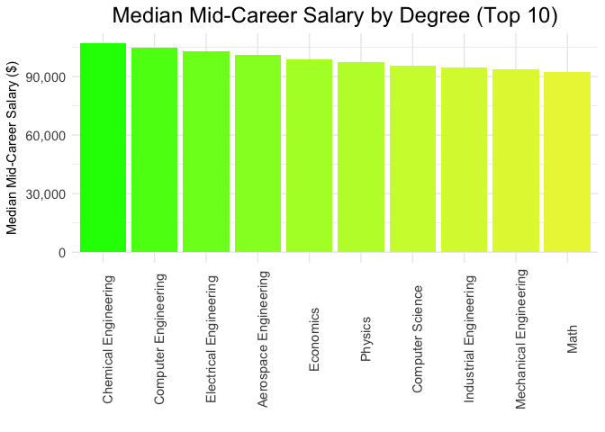
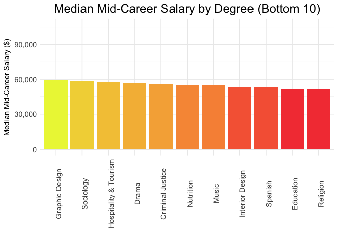
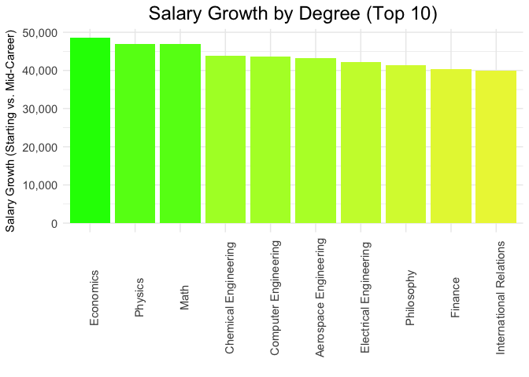
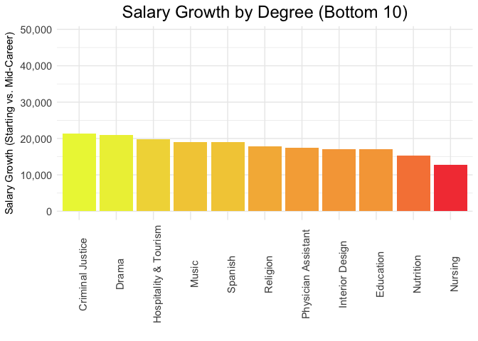
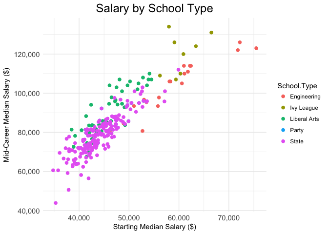
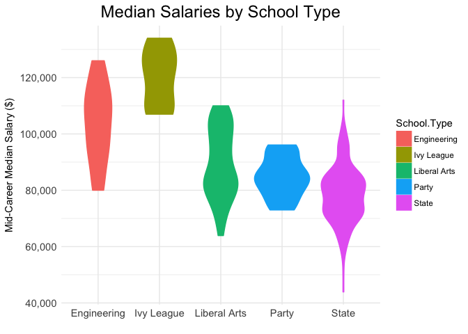
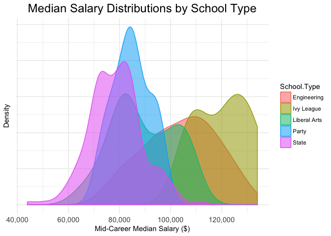
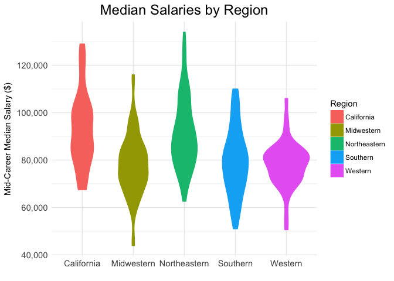
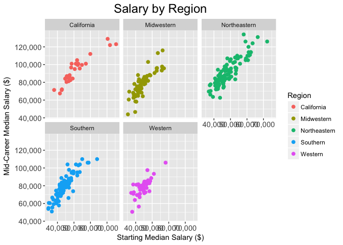

Data Visualization of College Alumni Salary
================

I do not know a whole lot about where this data came from, so I will leave that to David! The fun thing here is that the code, documentation, and output can live together in a single RMarkdown file. They are version controlled together, generate a single output, and thereby require significantly less maintenance to update. You can read more about rmarkdown [here](http://rmarkdown.rstudio.com/).

Visualization Using GGPlot
--------------------------

You can set `echo=TRUE` to illustrate the code chunks that built the respective plots. RMarkdown has a lot of power!

